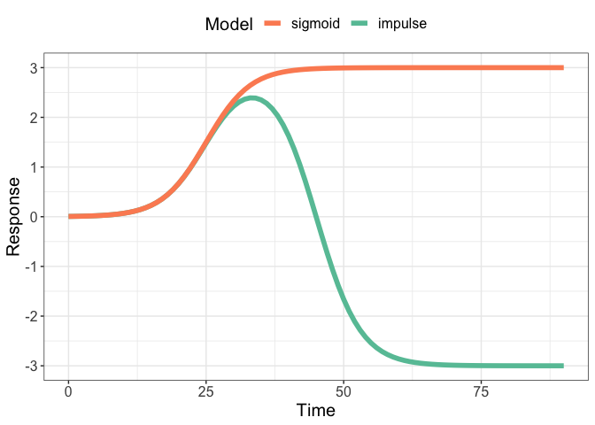

<!-- README.md is generated from README.Rmd. Please edit that file -->

# Impulse

This package implements the [Chechik &
Koller](https://www.ncbi.nlm.nih.gov/pubmed/19193146) impulse model
using TensorFlow to improve scaleability and allow for the introduction
of priors which improve model interpretability. This model describes
timeseries data using two sigmoidal responses which are sufficient to
capture the dynamics of many biological systems. While this model was
formulated to capture biological dynamics, the model is generally
suitable for any kind of saturation behavior described by half-max
value(s) and assymptote(s).

The core functionality of this package is:

  - simulate timecourse parameters and resulting timecourses
  - fit sigmoid and impulse models to timecourses with or without priors
    on kinetic parameters
  - compare sigmoid and impulse models
  - visualize measurements and parametric fits

## The model

This package revolves around two phenomonological models, the sigmoid
(single response) and impulse (double sigmoid). The plot below
highlights the value of these models. It is easy to mentally convert
between timecourses and kinetic paramters, but the kinetic parameters
are generally more meaningful since they indicate the timing and
magnitdue of responses.

A sigmoid with parameters {t\_rise = 25, v\_inter = 3, rate = 0.25} and
an impulse with two additional parameters {t\_fall = 45, v\_final = -3}
are shown. The t\_rise of 25 indicates a half-max time of 25 and
v\_inter of 3 indicates saturation at 3. In the impulse model there is a
second response with a half-max time of 45 and final assymptote at -3.

<!-- -->

### sigmoid


### implulse


## *Impulse* functionality

### Fitting Data

The primary functionality in this package is fitting parametric models
to user-supplied timecourses. The vignette *fitting-timecourses*
simulates time series, fits multiple models to each timecourse and then
determines the model that best fits each timecourse.

### Formulating priors

The most important contribution of this work is aaplying priors to
impulse models since there are natural constraints on parameter values
which should hold (non-negative rates, non-negative times, rise before
fall). When these constraints are violated, a good fit may occur, but
interpretability of timing and effect sizes will be lost. The vignette
*setting\_priors* describes how to formulate the priors and can be used
to guide the tuning of parameters for other application.

## Installation

The package is under active development though and the latest set of
features can be obtained by installing from this repository using
`devtools`

``` r
devtools::install_github('calico/impulse')
```
